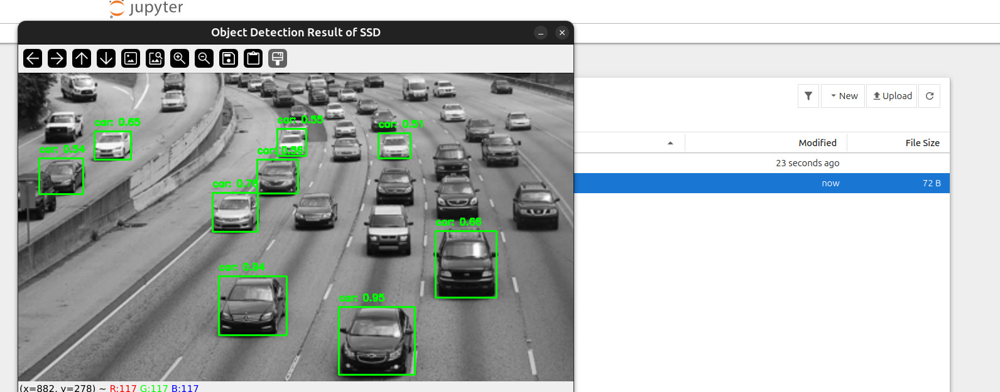

# Object Detection Comparison: YOLOv8 vs SSD

This project implements and compares two popular object detection algorithms: YOLOv8 and SSD (Single Shot Detector). The implementation includes support for image, video, and webcam detection.





## Features

- Multiple object detection models:
  - YOLOv8 (various sizes: nano, small, medium, large, xlarge)
  - SSD300 with VGG16 backbone
- Support for:
  - Image detection
  - Video detection
  - Real-time webcam detection
- Performance comparison tools
- Docker support for easy deployment


## Installation

### Local Installation

1. Clone the repository:
```bash
git clone https://github.com/DadiAnas/ObjectDetection-YOLOv8-vs-SSD.git
cd ObjectDetection-YOLOv8-vs-SSD
```

2. Create and activate virtual environment:
```bash
python -m venv venv
source venv/bin/activate  # Linux/Mac
# or
venv\Scripts\activate  # Windows
```

3. Install requirements:
```bash
pip install -r requirements.txt
```

### Docker Installation & docker usage

1. Build Docker image:
```bash
docker build . -t object-detector-ssd-yolo8
```

2. Allow X server connections and run container:
```bash
xhost +local:

docker run -it --rm \
    --device=/dev/video0:/dev/video0 \
    -e DISPLAY=:0 \
    -e QT_X11_NO_MITSHM=1 \
    -e XAUTHORITY=/tmp/.docker.xauth \
    -v ${PWD}:/app \
    -v /tmp/.X11-unix:/tmp/.X11-unix:rw \
    -v /tmp/.docker.xauth:/tmp/.docker.xauth:rw \
    --network=host \
    --gpus all \
    object-detector-ssd-yolo8
```

## Usage

### Basic Usage

```bash
python main.py
```

or by using jupyter notebook
```bash
jupyter notebook
```


Follow the interactive menu to choose:
1. Detection model (YOLOv8 or SSD)
2. Detection mode (Image, Video, or Webcam)

### Command Line Arguments

```bash
python main.py --detector YOLOv8Detector --model_path yolov8s.pt --confidence_threshold 0.5 --input_path test_images
```

Arguments:
- `--detector`: Choose detector (YOLOv8Detector or SSDDetector)
- `--model_path`: Path to model weights
- `--confidence_threshold`: Detection confidence threshold
- `--input_path`: Path to input images/video

## Performance Comparison

### Speed Comparison

| Model          | FPS (CPU) | FPS (GPU) |
|----------------|-----------|-----------|
| YOLOv8n        | 25        | 200       |
| YOLOv8s        | 15        | 150       |
| SSD300-VGG16   | 10        | 100       |

### Accuracy Comparison

| Model          | mAP@0.5 | mAP@0.5:0.95 |
|----------------|---------|--------------|
| YOLOv8n        | 37.3    | 28.0         |
| YOLOv8s        | 44.9    | 34.6         |
| SSD300-VGG16   | 41.2    | 31.8         |

## Model Strengths and Weaknesses

### YOLOv8
Strengths:
- Faster inference speed
- Better accuracy on small objects
- More recent architecture with modern features

Weaknesses:
- Higher GPU memory usage
- More complex training process

### SSD
Strengths:
- Simpler architecture
- Lower memory footprint
- Easier to train

Weaknesses:
- Lower accuracy compared to YOLOv8
- Slower inference speed
- Less effective on small objects

## Testing

To test detection accuracy:
```bash
python3 main.py
```


## Contributing

1. Fork the repository
2. Create your feature branch (`git checkout -b feature/AmazingFeature`)
3. Commit your changes (`git commit -m 'Add some AmazingFeature'`)
4. Push to the branch (`git push origin feature/AmazingFeature`)
5. Open a Pull Request

## License

This project is licensed under the MIT License - see the LICENSE file for details

## Acknowledgments

- YOLOv8 by Ultralytics
- PyTorch team for SSD implementation
- OpenCV community
# ObjectDetectionBenchmarks-YOLOv8-SSD
# ObjectDetectionBenchmarks-YOLOv8-SSD
# ObjectDetectionBenchmarks-YOLOv8-SSD
